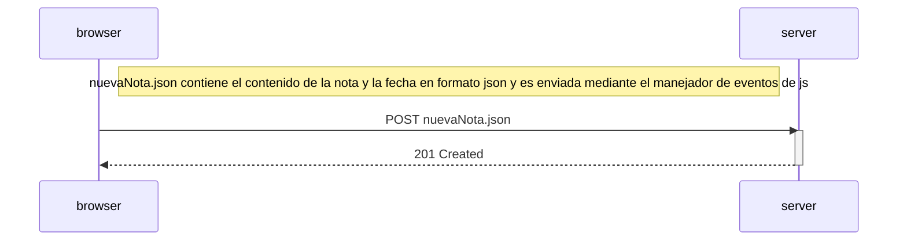

```mermaid

sequenceDiagram
  participant browser
  participant server

  Note right of browser: nuevaNota.json contiene el contenido de la nota y la fecha en formato json y es enviada mediante el manejador de eventos de js
  browser->>server: POST nuevaNota.json
  activate server
  server-->>browser: 201 Created
  deactivate server


```
